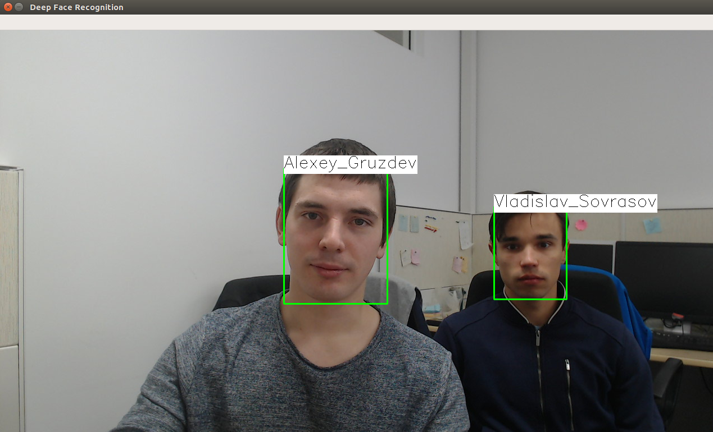

# Face Recognition demo with [OpenVINO™ Toolkit](https://software.intel.com/en-us/openvino-toolkit)



## Demo Preparation

1. Install **OpenVINO Toolkit** - [Linux installation guide](https://software.intel.com/en-us/articles/OpenVINO-Install-Linux)

2. Create virtual python environment:
```bash
  mkvirtualenv fr --python=python3
```
3. Install dependencies:
```bash
  pip install -r requirements.txt
```
4. Initialize OpenVINO environment:
```bash
source /opt/intel/computer_vision_sdk/bin/setupvars.sh
```

## Deep Face Recognition
1. Set up `PATH_TO_GALLERY` variable to point to folder with gallery images (faces to be recognized):
```bash
export PATH_TO_GALLERY=/path/to/gallery/with/images/
```
2. For using OpenVINO pretrained models, please specify `IR_MODELS_ROOT`, otherwise you need to modify running command.
```bash
export IR_MODELS_ROOT=$INTEL_CVSDK_DIR/deployment_tools/intel_models/
```
3. If you are running from pure console, you need to specify `PYTHONPATH` variable:
```bash
export PYTHONPATH=`pwd`:$PYTHONPATH
```
4. Run Face Recognition demo:
```bash
python demo/run_demo.py --path_to_gallery $PATH_TO_GALLERY --cam_id 0 \
  --fd_model $IR_MODELS_ROOT/face-detection-retail-0004/FP32/face-detection-retail-0004.xml \
  --fr_model $IR_MODELS_ROOT/face-reidentification-retail-0095/FP32/face-reidentification-retail-0095.xml  \
  --ld_model $IR_MODELS_ROOT/landmarks-regression-retail-0009/FP32/landmarks-regression-retail-0009.xml \
  -l libcpu_extension_avx2.so
```
*Note:* `libcpu_extension_avx2.so` is located at the `$INTEL_CVSDK_DIR/inference_engine/lib/<system_name>/intel64/` folder.
Here the `<system_name>` is a name detected by the OpenVINO. It can be for example `ubuntu_16.04` if you are running the demo under Ubuntu 16.04 system. The folder with CPU extensions is already in `LD_LIBRARY_PATH` after initialization of the OpenVINO environment, that's why it can be omitted in the launch command.
