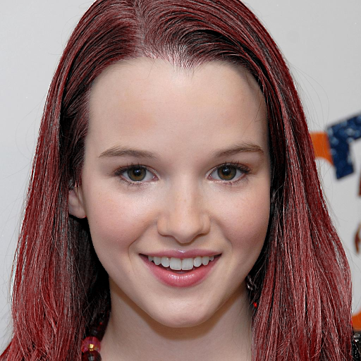
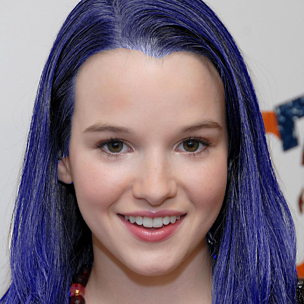
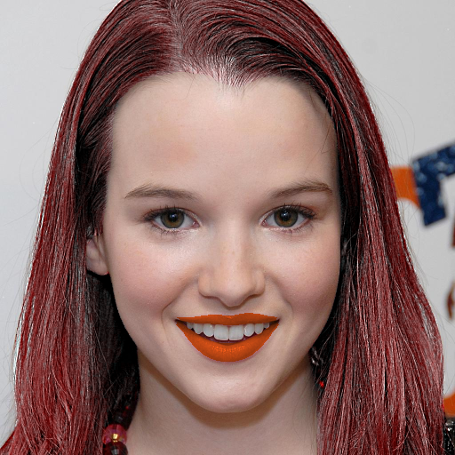

# Face parsing by Bisenet

Changqian Yu et al

## Training

1. Prepare training data:
    -- download [CelebAMask-HQ dataset](https://github.com/switchablenorms/CelebAMask-HQ)

	--  change file path in the `prepropess_data.py`  and run
```Shell
python prepropess_data.py
```

2. Train the model using CelebAMask-HQ dataset:
Just run the train script: 
```
    $ CUDA_VISIBLE_DEVICES=0,1 python -m torch.distributed.launch --nproc_per_node=2 train.py
```

If you do not wish to train the model, you can download [our pre-trained model](https://drive.google.com/open?id=154JgKpzCPW82qINcVieuPH3fZ2e0P812) and save it in `res/cp`.


## Demo
1. Evaluate the trained model using:
```Shell
# evaluate using GPU
python test.py
```

<p align="center">
	<a href="https://github.com/zllrunning/face-parsing.PyTorch">
    
	</a>
</p>


## Face makeup using parsing maps
[**face-makeup.PyTorch**](https://github.com/zllrunning/face-makeup.PyTorch)
<table>

<tr>
<th>&nbsp;</th>
<th>Hair</th>
<th>Lip</th>
</tr>

<!-- Line 1: Original Input -->
<tr>
<td><em>Original Input</em></td>
<td></td>
<td></td>
</tr>

<!-- Line 3: Color -->
<tr>
<td>Color</td>
<td></td>
<td></td>
</tr>

</table>


## References
If you find this work or code is helpful in your research, please cite:
````
@inproceedings{yu2018bisenet,
  title={Bisenet: Bilateral segmentation network for real-time semantic segmentation},
  author={Yu, Changqian and Wang, Jingbo and Peng, Chao and Gao, Changxin and Yu, Gang and Sang, Nong},
  booktitle={ECCV},
  year={2018}
}
````